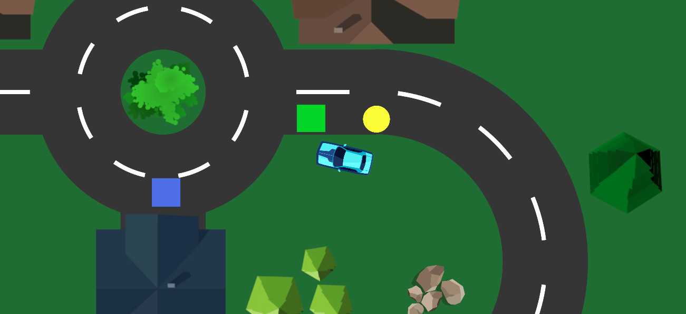

# delivery-driver

A delivery game follow the course "Complete C# Unity Game Developer 2D Online Course" in GameDev.tv

The gameplay functionality includes:

- Picking up packages (green squares)
- Deliverying objects to the destination (blue squares)
- Speed boosters (Yellow circles)
- Can color is chaning when package is picked & delivered

## Possible future improvements

- Randomize level
- Randomize package locations
- Re-spown packages in other locations when picked
- Background music
- Limit the area the car can drive to the location when the game actually appened